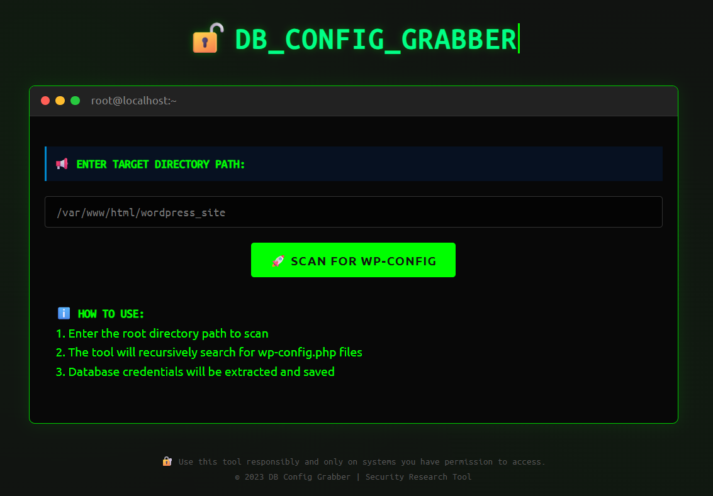

# **DB Config Grabber - WordPress Database Configuration Scanner**

  
*A terminal-style tool for scanning WordPress database configurations*

## 🔍 **Overview**
DB Config Grabber is a PHP-based tool designed to help WordPress administrators and developers quickly scan and extract database configuration details from multiple WordPress installations on a server.

**Key Features:**
- 🔎 Recursively scans directories for `wp-config.php` files
- 📋 Extracts database credentials (name, user, password, host, charset)
- 💾 Saves results to `result.txt`
- 🖥️ Terminal-style interface with hacker theme
- 🚀 Lightweight and easy to deploy

## ⚠️ **Important Legal Notice**
This tool is intended for **legitimate administrative purposes only**. You must have proper authorization to scan any website or server. Unauthorized use may violate laws and ethical guidelines.

## 🛠️ **Installation**
### Requirements:
- PHP 7.0+ (PHP 8+ recommended)
- Web server (Apache/Nginx)
- Read access to target directories

### Installation Steps:
1. Clone or download this file tools:
   ```bash
   curl -O https://raw.githubusercontent.com/JawaTengahXploit1337/MassGrabberDBWordPress/main/GrabDB.php
   ```
2. Upload `GrabDB..php` to your server
3. Set appropriate permissions:
   ```bash
   chmod 644 GrabDB..php
   ```

## 🚀 **Usage**
1. Access the tool via browser:
   ```
   https://yourserver.com/path/to/GrabDB.php
   ```
2. Enter the directory path you want to scan (e.g., `/var/www/html/`)
3. Click "Scan for WP-Config"
4. View results in browser and/or `result.txt`

## 📂 **Output Example**
```plaintext
📁 /var/www/site1/wp-config.php
🔑 NAME       : wp_db1
🔑 USER       : wp_user1
🔑 PASSWORD   : ********
🔑 HOST       : localhost
🔑 CHARSET    : utf8mb4

📁 /var/www/site2/wp-config.php
🔑 NAME       : wp_db2
🔑 USER       : wp_user2
🔑 PASSWORD   : ********
🔑 HOST       : 127.0.0.1
🔑 CHARSET    : utf8
```

## 🔒 **Security Best Practices**
- Always delete `result.txt` after use
- Restrict access to the tool directory via `.htaccess`:
  ```
  Order deny,allow
  Deny from all
  Allow from your.ip.address
  ```
- Consider password protecting the directory

## 📜 **License**
This project is licensed under the MIT License - see the [LICENSE](LICENSE) file for details.

## 🤝 **Contributing**
Contributions are welcome! Please open an issue or pull request for any improvements.

## 📧 **Contact**
For questions or support, please open a GitHub issue or contact:  
[Your Email]  
[Your Website]  

---

💡 **Tip:** For enhanced security, consider running this tool locally rather than on a production server.
